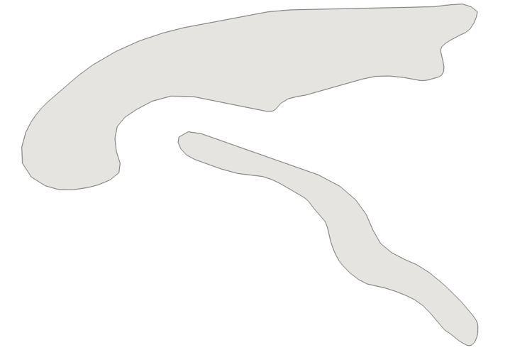

# create centerlines

This script reads polygon datasets such as i.e. the [geographic regions](
http://www.naturalearthdata.com/http//www.naturalearthdata.com/download/10m/physical/ne_10m_geography_regions_polys.zip)
from [Natural Earth](http://www.naturalearthdata.com/) and extracts smoothed
centerlines for better label placement.

To do so, it basically creates a [Voronoi diagram](
https://en.wikipedia.org/wiki/Voronoi_diagram) to get the polygon skeleton.
Finally, the centerline is selected and smoothed.



Steps:

1. Extract outline.
2. Segmentize outline to get more evenly distributed outline points.
3. Extract points.
4. If there are too many points, simplify the segmentized outline and Extract
   points again.
5. Create Voronoi diagram.
6. Select all Voronoi edges which are inside the source polygon.
7. Determine the best line.
8. Smooth line.

Basic usage:

```shell
create_centerlines.py <input_file> <output_file>

```
Parameters:
* ```--segmentize```: maximum length of line segment (default 0.5)
* ```--max_points```: maximum number of points allowed before generating the
Voronoi diagram (huge influence on performance) (default 3000)
* ```--simplification```: stepwise simplification value until geometry has less
than maximum number of points allowed (default 0.05)
* ```--smooth```: degree of smoothing to be applied to the final centerline
(default 5)
